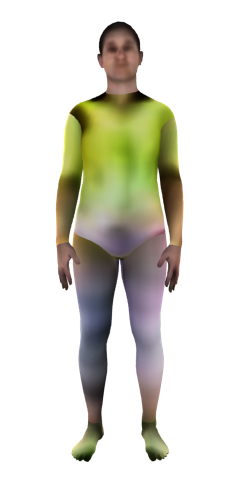
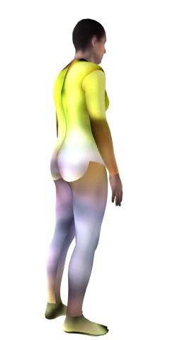

## SMPL Texture visualization using blender
<b>command</b> 
`
blender -b -t 1 -P render.py -- --angle 120 --model_path example/obj/1414_c6s3_074192_00/
`   
The original source is [BlenderRender](https://github.com/yt4766269/BlenderRender)
 
Input data : https://github.com/yt4766269/BlenderRender/tree/master/example/obj/1414_c6s3_074192_00
 

### Result images

 